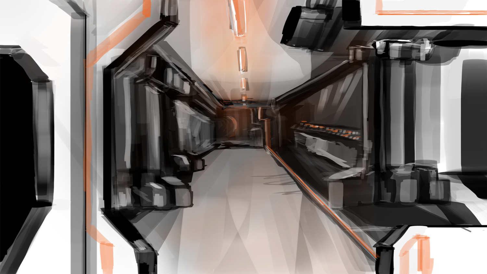

The Ragnarok is a stroy-driven game set in the far future within space. The main protagonist wakes up aboard their ship and must find out where, and what happened to the crew. The player makes their way through the ship solving puzzles to gain access further into the ship of which they were stationed to. With the protaganists memory completely wiped, they must work out what had happened and how to escape.

<h4>
Concept art
</h4>

     
<section class="profiles">      

       
<section class="3u 6u(medium) 12u$(xsmall) profile">        
        
<h4>Christopher Nash</h4>        

Programmer
       
</section>       

<section class="3u 6u(medium) 12u$(xsmall) profile">        
        
<h4>Nathan-David Coplestone</h4>        

Programmer
       
</section>       

<section class="3u 6u$(medium) 12u$(xsmall) profile">        
        
<h4>Kieran Goldsworthy</h4>        

Programmer
       
</section>       

<section class="3u 6u$(medium) 12u$(xsmall) profile">        
        
<h4>Nathan Henry</h4>        

Programmer
 
<section class="profiles">      

       

<section class="3u 6u(medium) 12u$(xsmall) profile">        
        
<h4>Ed Hannes Siebke</h4>        

Artist
       
</section>       

<section class="3u 6u(medium) 12u$(xsmall) profile">        
        
<h4>Kayleigh Clarke</h4>        

Artist
       
</section>       

<section class="3u 6u(medium) 12u$(xsmall) profile">        
        
<h4>Elliott Pearson</h4>        

Writer
       
</section>       

<section class="3u 6u$(medium) 12u$(xsmall) profile">        
        
<h4>Joe Fry</h4>        

Animator
       
</section>      

<section class="3u 6u$(medium) 12u$(xsmall) profile">
        
<h4>Jordan Jones</h4>        

Designer
       
</section>       

<section class="3u 6u(medium) 12u$(xsmall) profile">        
        
<h4>Chris Delaney</h4>        

Audio
       
</section>       

<section class="3u 6u$(medium) 12u$(xsmall) profile">        
        
<h4>Luca Lacobucci</h4>        

Designer
       
</section>    

<html> <body>  <iframe width="560" height="315" src="</section>       

<section class="3u 6u$(medium) 12u$(xsmall) profile">        
        
<h4>Joe Fry</h4>        

Animator
       
</section>      

<section class="3u 6u$(medium) 12u$(xsmall) profile">
        
<h4>Jordan Jones</h4>        

Designer
       
</section>       

<section class="3u 6u(medium) 12u$(xsmall) profile">        
        
<h4>Chris Delaney</h4>        

Audio
       
</section>       

<section class="3u 6u$(medium) 12u$(xsmall) profile">        
        
<h4>Luca Lacobucci</h4>        

Designer
       
</section>    

<html> <body>  <iframe width="560" height="315" src="https://www.youtube.com/embed/mzY48FloO8c"

 frameborder="0" allowfullscreen></iframe> </body></html>

