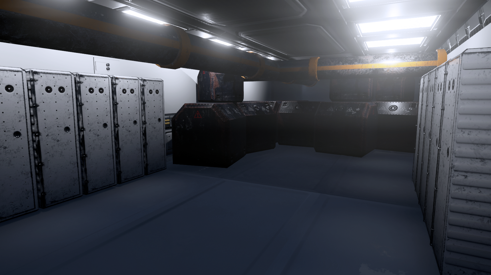
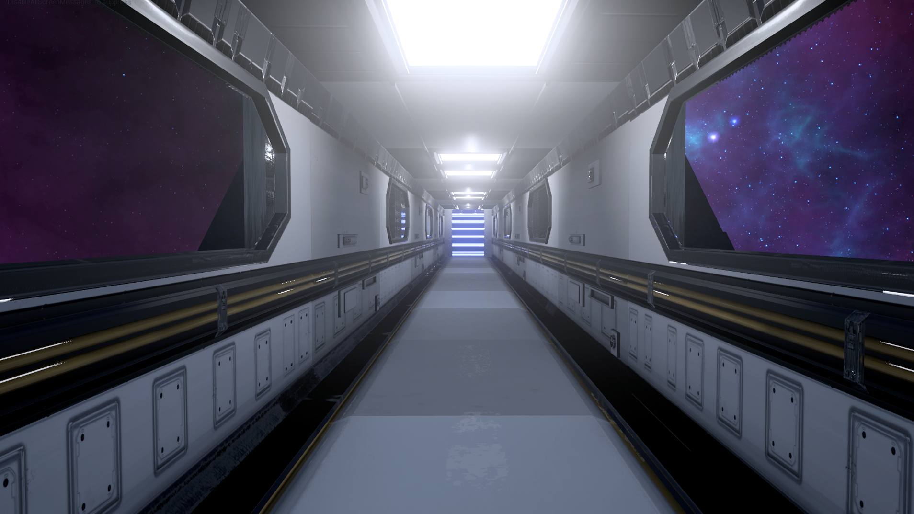

AN 80’S CYBERPUNK HACK-N-SLASHDEATH BATTLE ARENAINSPIRED BY TRON, BLOOD DRAGON, KUNG FURY AND DEVIL MAY CRY.
Stylized Models, Low Poly,High Quality Textures (Think Superhot) Dark & Grimy FeelLots of Neon/Cyberpunk Tones
Use Basic attacks to build combo-meterCombo System allows you to chain takedowns.
You are Kojin, a Ronin. With your sword, Akuma, you are sent far into the future by an Insane, Homicidal A.I. only known as Moreau. In the future, you have to fight to return.
Designed to be Arena-like.Cyberpunk ThemesLots of Neon.

     <section class="profiles">      
       <section class="3u 6u(medium) 12u$(xsmall) profile">                <h4>James Pitt</h4>        
Programmer
       </section>       <section class="3u 6u(medium) 12u$(xsmall) profile">                <h4>Steven Cowie</h4>        
Programmer
       </section>       <section class="3u 6u$(medium) 12u$(xsmall) profile">                <h4>Kieran Welch</h4>        
Programmer
       </section>       <section class="3u 6u$(medium) 12u$(xsmall) profile">                <h4>Joshua Daniels</h4>        
Programmer
       </section>      
     </section>          <section class="profiles">      
       <section class="3u 6u(medium) 12u$(xsmall) profile">                <h4>Ed Hobson</h4>        
Artist
       </section>       <section class="3u 6u(medium) 12u$(xsmall) profile">                <h4>Joel Dash</h4>        
Artist
       </section>       <section class="3u 6u(medium) 12u$(xsmall) profile">                <h4>Jesse Kay</h4>        
Artist
       </section>       <section class="3u 6u$(medium) 12u$(xsmall) profile">                <h4>Nathan Fisher Mantej</h4>        
Artist
       </section>      
     </section>          <section class="profiles">      
       <section class="3u 6u$(medium) 12u$(xsmall) profile">                <h4>Connor Abbott</h4>        
Animator
       </section>       <section class="3u 6u(medium) 12u$(xsmall) profile">                <h4>Rupert Nicol</h4>        
Designer
       </section>       <section class="3u 6u$(medium) 12u$(xsmall) profile">                <h4>Edmund Dunstan</h4>        
Writer
       </section>      
     </section>    

<h4>
Overview of the map
</h4><h4>
Initial capture of the game
</h4><h4>
The main menu
</h4><h4>
The combat
</h4>
<html> <body>  <iframe width="560" height="315" src="https://www.youtube.com/embed/mzY48FloO8c" frameborder="0" allowfullscreen></iframe> </body></html>
